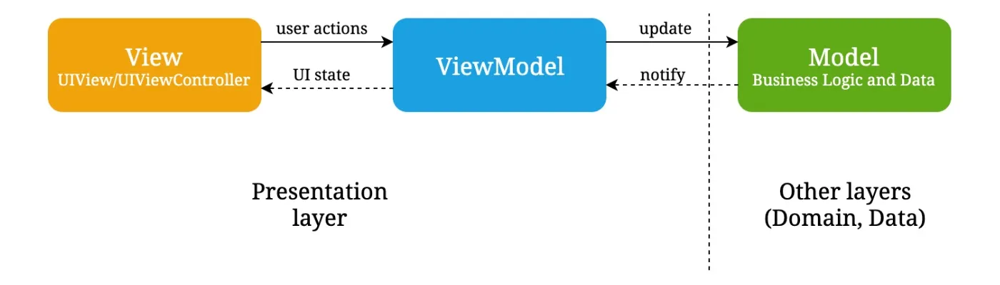

# WeatherApp
Weather app using openweathermap api, and show 5 days weather forecast data with 3-hour step.

----------------------
** OpenWeather Documentation**: https://openweathermap.org/forecast5 

- **Used OpenWeather API:** "https://api.openweathermap.org/data/2.5/forecast?lat=\(lat)&lon=\(long)&appid=9792211e188419e81c214029d430007c&units=Metric"

- lat: latitute
- long: longitute
- appid: {API key}
- units: Units for temperature measurement(standard, metric, and imperial).

- Fetch 5 days weather information from api. (Default used **Dubai, UAE** location)

- In the app Present information from api is the **Date, Time, weather icon, and temperature**.

- Fetch **weather icon** using https://openweathermap.org/img/wn/\(imgName)@2x.png API. Just pass weather icon name in imgName from api value.

- Using CollectionView for Horizontal scroll.

- Inside the collectionView, using TableView for per day weather list present.

- From api, getting list of weather in array, so filter and group by day using heigherOrder function.

- Show **city name** from weather api **city** parameter. So if we change the location in code, we will get updated city name according to the location.

- Added JSON file in project for fixed data.

- **Used 3rd party frameworks**
    - **Alamofire**: For APIs call
    - **SDWebImage**: Fetch images from api
    - **AlamofireEasyLogger**: Printing APIs response
    - **IQKeyboardManagerSwift**: handling keyboard typing 
    - **NVActivityIndicatorView**: Showing loader while running apis 

- **App Architecture**
    - Used **MVVM** Design Pattern
    - And used **Combine**: For Binding data between View && ViewModel

- **Used Modern Concurrency**
    - **Actor**
    - **MainActor**
    - **Async-await**
    - **Async let**

- **Used Unit Test**
    - ViewModel subgroup contains tests written on ViewModels
    - Networking subgroup contains tests written on Network Services

### Following test cases are written:
- Weather Service test for checking if forecast is fetched correctly.
- Image Service test for checking if weather icon image is fetched correctly.
- AutoCompleteViewModelTest for testing AutoCompleteViewModel to make sure view model behaves correctly.
- Url encoding test for URLEncoder to see if urls are being configured correctly.
- **Applied Clean code**

- **Applied OOP**
--------------------------------------------
